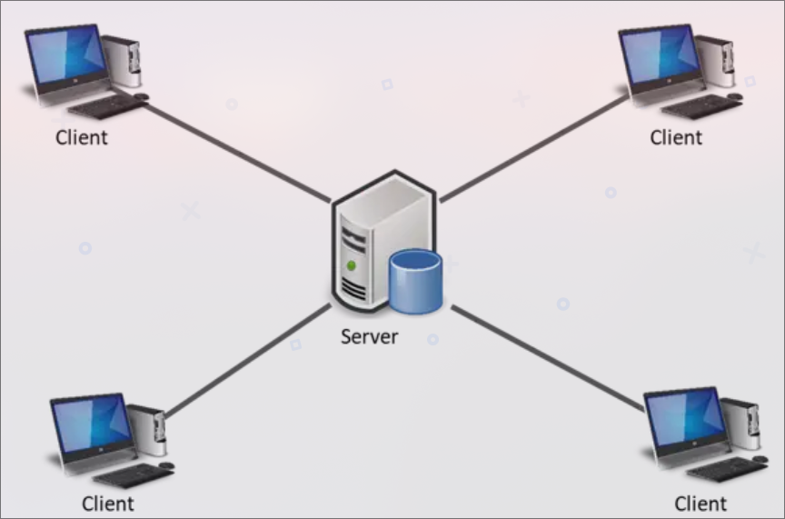

# Memoria de Prueba de Evaluación Contínua SIDI
> Uned Curso 2025-2026 -- Autor: Víctor Javier Serrano Moroder

[Visita el proyecto y la memoria en markdown.](https://github.com/VictorSerranoMoroder/pec_sidi_vjsm)

## 1. Introducción
Este proyecto implementa un sistema distribuido de microblogging (similar a Twitter) utilizando Java RMI.
El sistema se compone de tres entidades principales:

**Servidor**: Gestiona la autenticación de usuarios y la lógica de negocio del sistema.

**Base de Datos**: Mantiene todos los datos persistentes en memoria (users, trinos, seguidores).

**Cliente / Usuario**: Permite la interacción de los usuarios, incluyendo registro, login y publicación de trinos.

El proyecto sigue el patrón *cliente-servidor distribuido con RMI y callbacks* para notificaciones push.

## 2. Estructura del proyecto
```
├── api
│   ├── CallbackUsuarioInterface.java
│   ├── ServicioAutenticacionInterface.java
│   ├── ServicioDatosInterface.java
│   └── ServicioGestorInterface.java
├── cliente
│   ├── CallbackUsuarioImpl.java
│   ├── ClienteImpl.java
│   └── Cliente.java
├── database
│   ├── Basededatos.java
│   ├── ModeloDatos.java
│   └── ServicioDatosImpl.java
├── data_model
│   ├── AutenticacionRequest.java
│   ├── ErrorResult.java
│   ├── RegistroRequest.java
│   ├── requests
│   │   ├── AddFollower.java
│   │   ├── AddTrino.java
│   │   ├── AddUser.java
│   │   ├── BanUser.java
│   │   ├── GetAllTrinos.java
│   │   ├── GetFeed.java
│   │   ├── GetFollowers.java
│   │   ├── GetTrinos.java
│   │   ├── GetUser.java
│   │   ├── GetUsers.java
│   │   ├── ProcedureRequest.java
│   │   ├── QueryRequest.java
│   │   ├── RemoveFollower.java
│   │   ├── Request.java
│   │   └── UnbanUser.java
│   ├── Result.java
│   ├── SuccessResult.java
│   ├── Trino.java
│   └── User.java
├── module-info.java
└── servidor
    ├── ServicioAutenticacionImpl.java
    ├── ServicioGestorImpl.java
    └── Servidor.java
```

## 3. Arquitectura y diseño
#### 3.1 Patrón Cliente-Servidor
El proyecto sigue un patrón clásico cliente-servidor distribuido donde se intercambia información entre los siguientes actores:

**Cliente**: Interfaz de usuario que envía solicitudes al servidor y recibe notificaciones push mediante un callback remoto.

**Servidor**: Encapsula la lógica de negocio y coordina las operaciones sobre los datos. Es el responsable de validar requests, gestionar la autenticación, los procedimientos y el envío de trinos a los seguidores logueados.

**Comunicación**: Todo se realiza mediante Remote Method Invocation (RMI), que permite invocar métodos de objetos remotos como si fueran locales, ocultando la complejidad de la red.



#### 3.2 Patrón Result
Para la comunicación de Servidor-Basededatos, se ha utilizado el patrón de **Result**. Es una técnica que se utiliza para manejar resultados exitosos o errores en una operación. Generalmente presenta la siguiente forma:

```java
public class Result<TClass>
{
    public T Value { get; }
    public boolean IsSuccess { get; }
    public String ErrorMessage { get; }

    private Result(T value)
    {
        Value = value;
        IsSuccess = true;
    }

    private Result(string errorMessage)
    {
        ErrorMessage = errorMessage;
        IsSuccess = false;
    }

    public static Result<TClass> Success(TClass value) => new Result<TClass>(value);
    public static Result<TClass> Failure(string errorMessage) => new Result<TClass>(errorMessage);
}
```

En el caso de esta práctica **Result** es virtualmente idéntico funcionalmente, simplemente el hecho de que sea un fallo o no, está explícitamente indicado en la especialización de la interfaz sellada base, tal que:

```java
public sealed interface Result<TClass extends Serializable> extends Serializable
	permits SuccessResult, ErrorResult {};

public record SuccessResult<TClass extends Serializable>(
	    Request request,
	    TClass data
	) implements Result<TClass> {}

// ErrorResult no parametriza el tipo genérico ya que en caso de error no existe un valor de retorno válido,
// simplificando así el tratamiento de fallos.
public record ErrorResult(
	    Request request,
	    String message
	) implements Result {}
```

Si el resultado es correcto se envía un objeto tipo `SuccessResult` y en caso de error se devuelve un objeto de tipo `ErrorResult`.

#### 3.3 Interfaces selladas y Pattern Matching
Las interfaces `sealed` son una característica introducida a partir de la versión 17 que permite restringir qué clases o interfaces pueden implementarla, proporcionando un control más estricto sobre la herencia y la extensibilidad.

Esto es muy útil no solo porque reduzca el riesgo de extensiones no deseadas, sino también porque puede integrarse con *pattern matching*. El *pattern matching* es una técnica en la que, dentro de un `switch`, **el compilador conoce todas las variantes posibles de un tipo sellado**, lo que permite verificaciones de tipo más seguras y completas en tiempo de compilación.

Esto último es extremadamente útil para el caso de las Peticiones del servidor, estas están definidas de la siguiente manera:

```java
public sealed interface Request extends Serializable
	permits QueryRequest, ProcedureRequest{}

public sealed interface QueryRequest<TClass extends Serializable> extends Request
	permits GetUser, GetUsers, GetFeed, GetFollowers, GetAllTrinos, GetTrinos {}

public sealed interface ProcedureRequest<TClass extends Serializable> extends Request
    permits AddUser, AddTrino, AddFollower, BanUser, UnbanUser, RemoveFollower {}
```

Las interfaces previas nos permiten crear un **dispatcher** haciendo uso del pattern matching como se muestra en el snippet haciendo que la llamada a los handlers sea muy visual y fácil de extender y modificar:
```java
@Override
	public Result realizarQuery(QueryRequest request) throws RemoteException {
		return switch (request) {
			case GetUser q      -> handleGetUser(q);
	        case GetUsers q     -> handleGetUsers(q);
	        case GetFollowers q -> handleGetFollowers(q);
	        case GetAllTrinos q -> handleGetAllTrinos(q);
	        case GetTrinos q    -> handleGetTrinos(q);
	        case GetFeed q      -> handleGetFeed(q);
		};
	}

	@Override
	public Result ejecutarProcedimiento(ProcedureRequest request) throws RemoteException {
		return switch (request) {
			case AddTrino p		-> handleAddTrino(p);
			case AddUser p		-> handleAddUser(p);
			case AddFollower p  -> handleAddFollower(p);
			case BanUser p		-> handleBanUser(p);
			case UnbanUser p	-> handleUnbanUser(p);
			case RemoveFollower p -> handleRemoveFollower(p);
			case SetOnlineUser p -> handleSetOnlineUser(p);
		};
	}
```

#### 3.6 Callbacks y patrón Observer
Para permitir notificaciones push de nuevos trinos a los usuarios que siguen a otros usuarios, se implementa un patrón Observer distribuido usando RMI. La idea es que cada vez que un usuario publica un trino, todos sus seguidores conectados reciben el trino sin necesidad de hacer ninguna petición rutinaria al servidor. Para ello participan los siguientes actores:

- **CallbackUsuarioInterface**: interfaz remota que define el método que el cliente implementará para recibir notificaciones:

```java
public interface CallbackUsuarioInterface extends Remote {
    void recibirTrino(Trino trino) throws RemoteException;
}
```


- **CallbackUsuarioImpl**: Implementación concreta en el **cliente** que se encarga de recibir los trinos y mostrarlos por consola:
```java
public class CallbackUsuarioImpl extends UnicastRemoteObject implements CallbackUsuarioInterface {
    public CallbackUsuarioImpl() throws RemoteException {
		super();
		// TODO Auto-generated constructor stub
    }


    	@Override
	public void recibirTrino(Trino trino) throws RemoteException {
		// TODO Auto-generated method stub
		System.out.println("---------");
		System.out.println("Nuevo trino de: " + trino.GetNickPropietario());
		System.out.println(trino.GetTrino());
		System.out.println("---------");
    }
}
```

- **Servidor**: mantiene un `HashMap<String, CallbackUsuarioInterface>` de usuarios conectados. Cuando un usuario publica un trino el servidor recorre sus seguidores y uno a uno los va notificando siempre y cuando el usuario no esté bloqueado:

```java
case SuccessResult<?> ok -> {
    // El trino ha sido añadido con éxito a la base de datos
    // ahora hay que realizar un broadcast de este trino a todos sus seguidores
    Result<ArrayList<String>> followerResult = service.realizarQuery(new GetFollowers(trino.GetNickPropietario()));

    switch(followerResult)
    {
        case SuccessResult<ArrayList<String>> okGetFollowers -> {
            // Se ha recuperado los seguidores del autor del trino
            // Por cada seguidor se intenta recuperar el callback correspondiente para enviarle la notificacion
            okGetFollowers.data().forEach(username -> {
                Optional<CallbackUsuarioInterface> cb = Optional.ofNullable(callbackMap.get(username));
                if(cb.isPresent())
                {
                    try {
                        // Hay que recuperar los datos del usuario para comprobar si está bloqueado
                        Result <User> userResult = service.realizarQuery(new GetUser(username));

                        switch (userResult) {
                            case SuccessResult<User> okGetUser -> {
                                if (!okGetUser.data().isBanned)
                                {
                                    // Si no está baneado se llama al callback
                                    cb.get().recibirTrino(trino);
                                }
                            }
                            case ErrorResult errGetUser -> {}
                        }
                    } catch (RemoteException e) {
                        // En caso de error podemos deducir que o el callback es inválido o el cliente se ha desconectado
                        // En ambos casos eliminamos la entrada en el diccionario
                        callbackMap.remove(username);
                    }
                }
            });
            return true;
        }
        case ErrorResult errGetFollowers -> {
            return false;
        }
    }
}
```


## 4. Base de datos
Por requisito de la práctica la base de datos está centralizada y vive en memoria principal, esto simplifica el acceso de datos ya que no es necesario lidiar con bases de datos de terceros ni llamadas a APIs. La memoria está organizada en 2 estructuras:

- Usuarios registrados `ArrayList<User>`: lista de usuarios que han sido registrados en el sistema.

- Seguidores y Trinos `HashMap<String, UserData>`: cada usuario registrado en el sistema tiene un registro en este mapa donde su nombre de usuario actúa de clave primaria. `UserData` incluye:
- Lista de usuario a los que se sigue.
- Lista de trinos publicados

Dado el alcance de la práctica y la centralización de la base de datos, **no se ha implementado control de concurrencia**, aunque en un escenario real sería necesario proteger las estructuras compartidas.


## 5. Gestión de Peticiones y resultados entre Server-Basededatos
> Esta sección es deliberadamente detallada, ya que el mecanismo de intercambio de datos constituye el núcleo del sistema distribuido y es donde se concentran las principales decisiones de diseño.

Dada la naturaleza de la práctica es vital gestionar correctamente las entradas y las salidas de los datos en los diferentes servicios. Las peticiones y los resultados han de ser:

- Fácilmente reconocibles, y legibles
- Fácilmente escalable
- **type safe**

En toda comunicación tenemos 2 elementos principales:
- `Request`: Es la petición inicial que inicia la comunicación
- `Result`: Es la respuesta del segundo agente que participa en la comunicación

Se utiliza un enfoque basado en objetos comando (Command Pattern) y **DTOs** tipados para encapsular las peticiones y sus resultados.

Vamos a analizar cuidadosamente cada uno de los elementos y analizar su funcionamiento a la vez que argumentamos las diferentes decisiones de diseño.

#### Request
Como se ha indicado previamente, es el objeto que representa la petición inicial, el tipo de petición se elige a partir de especializaciones del tipo base, desde el tipo base de `Request` tenemos 2 especializaciones principales:

- `QueryRequest`: utilizada para peticiones *read-only*
- `ProcedureRequest`: utilizada para peticiones *write*

```java
public sealed interface Request extends Serializable
	permits QueryRequest, ProcedureRequest{}

public sealed interface QueryRequest<TClass extends Serializable> extends Request
	permits GetUser, GetUsers, GetFeed, GetFollowers, GetAllTrinos, GetTrinos {}

public sealed interface ProcedureRequest<TClass extends Serializable> extends Request
    permits AddUser, AddTrino, AddFollower, BanUser, UnbanUser, RemoveFollower {}
```
Como se puede ver en el snippet anterior, para cada tipo de petición existen especializaciones que son instanciables, una por cada tipo de operación, esto funcionalmente sustituye a un enumerado. Cada una de estas instancias se comporta funcionalmente como un **DTO**, **Data Transfer Object**, son un tipo concreto de objetos diseñados para llevar y definir datos entre diferentes procesos.

Para peticiones que no aporten datos, como puede ser el caso de `GetAllTrinos`, no es necesario aportar ningún dato ya que la base de datos puede resolverlo por si misma,

```java
public record GetAllTrinos() implements QueryRequest<ArrayList<Trino>> {}
```

Sin embargo muchas peticiones, sobretodo cuando se pregunta por un usuario específico, sí necesitan de información adicional que ha de aportar el emisor de la petición. Para ello las requests han de ser capaces de almacenar datos de diferentes tipos. Es por eso que soportan parámetros genéricos. Antes de todo se ha de definir en que punto y a que nivel se necesitará cargar con la información de los tipos, dado que la base de datos tiene esta interfaz:

```java
public <TClass extends Serializable> Result<TClass> realizarQuery(QueryRequest<TClass> request) throws RemoteException;
public <TClass extends Serializable> Result<TClass> ejecutarProcedimiento(ProcedureRequest<TClass> request) throws RemoteException;
```

Existe un punto de entrada para queries, donde se tendrá que instanciar una especialización de `QueryRequest` para peticiones *readonly* y otra que servirá de punto de entrada para peticiones de tipo *write* `ProcedureRequest`. Estos son las interfaces que habrán de cargar con la información de tipo.

Esto introduce un riesgo potencial si no se controla el uso de genéricos, ya que los genéricos son libres, y pueden ser muy inseguros (a nivel de **type safety**) si se usan de forma no adecuada, para resolver este problema los records específicos de las interfaces anteriores son las que definen el tipo concreto que han de llevar:

```java
public record GetUser(String username) implements QueryRequest<User> {}
```

Al llevar consigo la información de tipo, las dos requests resolverán en tiempo de compilación cada una de las opciones permitidas y, por tanto, el resultado es una comunicación segura.

>Es importante definir TODOS los posibles casos ya que el compilador tiene que tener definido de antemano que hacer con cada tipo que entre en la función. Esto es más que posible gracias a que estamos utilizando **interfaces selladas** y por tanto sabemos perfectamente cuántas clases derivadas existen y cuales son instanciables.

Para ilustrar mejor su funcionamiento seguiremos el flujo de Servidor-Basededatos cuando se realice una petición de tipo `GetUser`. Primero se instancia la petición (`Request`) desde el servidor:

```java
//server-side
ServicioDatosInterface service =
	            (ServicioDatosInterface) registry.lookup("ServicioDatos");

// Nótese que la query devuelve un Result con información de tipo
// que viene definida por la petición instanciada, en este caso GetUser
Result<User> result = service.realizarQuery(new GetUser(request.usuario.username));
```

La base de datos recoge la petición y usando un patrón de **Factoría/Dispatcher**, gestiona cada tipo de petición de forma diferente reenrutándola a sus respectivos handlers. Luego el handler realiza sus operaciones y devuelve un `Result`.


```java
//database-side
public Result realizarQuery(QueryRequest request) throws RemoteException {
    return switch (request) {
        case GetUser q      -> handleGetUser(q);
        case GetUsers q     -> handleGetUsers(q);
        case GetFollowers q -> handleGetFollowers(q);
        case GetAllTrinos q -> handleGetAllTrinos(q);
        case GetTrinos q    -> handleGetTrinos(q);
        case GetFeed q      -> handleGetFeed(q);
    };
}
```


#### Result
Habiendo analizado cómo funciona el **Request** el result funciona de forma muy similar y está basado, como su nombre indica, en el patrón de **Result**. Siguiendo con el flujo con el que terminamos la sección anterior sección de Request, se manejaría tal que así:

```java
//database-side
private Result handleGetUser(GetUser request)
{
    Optional<User> result = modeloDatos.getUser(request.username());
    if (result.isPresent())
    {
        return new SuccessResult<User>(request, result.get());
    }
    else
    {
        return new ErrorResult(request,"No se pudo encontrar el usuario " + request.username());
    }
}

```

Posteriormente el resultado se recoge desde el servidor en este caso y utilizando el mismo patrón que en la base de datos del **Dispatcher** tratamos los casos existentes. Pero antes recordemos brevemente que relación tienen los tipos que almacena el **Result** y el **Request**, esta relación la podemos encontrar en la interfaz y en la definición del **Request** específico:

```java
public interface ServicioDatosInterface extends Remote {
    public <TClass extends Serializable> Result<TClass> realizarQuery(QueryRequest<TClass> request) throws RemoteException;
    ...
}

// Nótese que el tipo pedido por la petición está definido como User aquí
public record GetUser(String username) implements QueryRequest<User> {}
```

Por lo tanto, en este caso, la operación de `GetUser` nos devolverá un `User` y esto lo sabe el compilador y por lo tanto es resoluble y comprobable en tiempo de compilación haciendo que el tratamiento de datos sea **type safe** y siempre trabajemos con el **DTO** correspondiente.

Continuando con el ejemplo, se definen flujos para el caso de que result sea de tipo `SuccessResult` y para el caso de que sea de tipo `ErrorResult`.

```java
// Server-side
Result<User> result = service.realizarQuery(new GetUser(request.usuario.username));

switch(result)
{
    case SuccessResult<User> ok -> {
        User data = ok.data();
        return request.usuario.username.equals(data.username) && request.usuario.password.equals(data.password);
    }
    case ErrorResult err -> {
        System.out.println("Autentificacion fallida");
        System.out.println(err.message());
    }
}
```

## 4. Ventajas del diseño
1. **Type Safety**
    - Las `Request` y `Result` parametrizadas permiten que el compilador verifique en tiempo de compilación los tipos de datos que se envían y reciben.
    - Evita `ClassCastException` en la comunicación RMI al recoger resultados complejos.
2. **Escalabilidad**
    - Las responsabilidades de dominio están claramente delimitadas y marcadas y permite extender el sistema a múltiples instancias de servidor siempre con mayor facilidad.
3. **Mantenibilidad**
    - Los **DTOs** tipados y el dispatcher centralizado en la parte de database facilitan la comprensión y la modificación de código.

## 5. Conclusión
El proyecto implementa un sistema de microblogging sencillo haciendo uso de **Java RMI** que:
- Asegura que la comunicación sea segura y tipada entre Servidor y Base de datos
- Garantiza una gestión robusta de los resultados
- Diseñado sobre escalabilidad y fácil mantenimiento

El proyecto ha sido realizado usando el IDE de Eclipse y la memoria está originalmente escrita en markdown, además el source del proyecto se puede encontrar en el siguiente repositorio:

[Visita el proyecto y la memoria en markdown.](https://github.com/VictorSerranoMoroder/pec_sidi_vjsm)